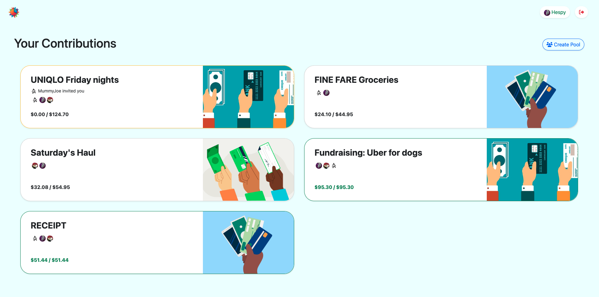
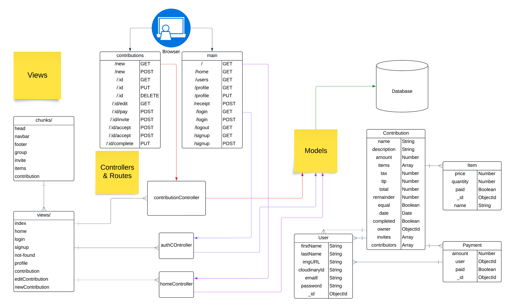
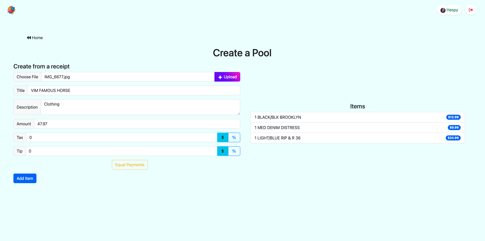

      

# PaySplit

PaySplit is an app that simplifies splitting bills among friends by allowing easy money pooling and automatic calculation of shares, including complex scenarios like tax and tips, with real-time updates for transparent and fair settlements.
**Website:** [PaySplit Home](https://paysplit.jesulayomi.tech)




## How It's Made:

**Tech used:** `Express`, `Node.js`, `MongoDB`, `ejs`, `Cloudinary`, `Github`, `Heroku`, `HTML`, `CSS`, `JavaScript`, 

The application was built using `node.js` as the environment, It uses an `Express` server, `MongoDB` database for storage, `Gemini` for Reciept parsing, `Cloudinary` for image storage and `Passport` for authentication strategies in the core backend. On the front end, It uses `HTML/CSS`, `EJS`, `Bootstrap`, `Font Awesome`.
The application follows the MVC framework as shown:



### Installation

To install, clone the repository, install npm packages, populate `.env` file using [.example.env](./.example.env)

On the terminal...
```bash
git clone https://github.com/Jesulayomy/PaySplit.git
cd PaySplit
touch .env
vi .env
```

From [.example.env](./.example.env), in your .env file
```shell
# Server
PORT = 5555
SECRET = "APP_$VPER_$E(RE+_$+R1NG"

# MongoDB
DB_STRING = "mongodb://localhost:27017/paySplit"

# Google (Gemini)
GOOGLE_API_KEY = "GOOGLE_API_KEY_FOR_GEMINI"

# Cloudinary
API_SECRET = "CLOUDINARY_API_SECRET"
CLOUD_NAME = "CLOUDINARY_CLOUD_NAME"
API_KEY = "CLOUDINARY_API_KEY"
```

Terminal...
```bash
npm install
npm start # OR npm run dev for dev version
```

## Optimizations

- Using structured output for reciept data eliminated need for cleaning data: [JSON mode](https://ai.google.dev/gemini-api/docs/structured-output)
- Used the socket.io library to enable real time updates of contribution changes through an emitter and listener.
- Utilized ejs partials (`chunks`) to reuse content like navbars, headers, and other content across several pages.

## Lessons Learned

I learned more about socket IO, bootstrap classes, responsive classes, JSON mode.

- Using sockets to emit , broadcast and listen for events.
```javascript
io.on('connection', (socket) => {
  console.log('A user connected');
  //...
  socket.on('disconnect', () => {
    console.log('User disconnected');
  });
});
```

- Using responsive classes to create more features
```css
@media (min-width: 576px) {
  .rounded-sm-bottom-0 {
    border-bottom-left-radius: 0 !important;
    border-bottom-right-radius: 0 !important;
  }
  .rounded-sm-end-5 {
    border-top-right-radius: 32px !important;
    border-bottom-right-radius: 32px !important;
  }
}
```

- JSON mode for recieving structured data from the generative model.
```javascript
const response = await AI.models.generateContent({
  model: 'gemini-2.0-flash',
  contents: contents,
  config: {
    responseMimeType: 'application/json',
    responseSchema: {
      type: Type.OBJECT,
      properties: {
        tip: {
          type: Type.NUMBER,
          description: 'Tip in usd to two decimal places, or 0 if not found',
          nullable: false,
          default: 0,
        },
        //...
        items: {
          type: Type.ARRAY,
          items: //...
        }
      },
      required: ['tip', '...', 'items'],
    },
  },
});
```




### PUBLIC ACCESS

You can use the following login details to access the site:
```json
{
  "email": "test@tester.com",
  "password": 12345678,
}
```
or signup for your own account.


## My Other projects
- [SCHub](https://github.com/Jesulayomy/SCHub)
- [Bidds](https://github.com/Jesulayomy/bidd)
- [Homez](https://github.com/Jesulayomy/homez)
- [Shelf Sync](https://github.com/Jesulayomy/shelf-sync)

## Contributing

Pull requests are welcome, for major changes, please open an issue first to discuss what you would like to change. Ensure to read the [contribution](CONTRIBUTING.md) and [conduct](CODE_OF_CONDUCT.md) pages, and document changes properly in the [CHANGELOG](CHANGELOG.md).

### Contributors

| [Jesulayomy](https://github.com/Jesulayomy) | 
| --- | 
|  | 
